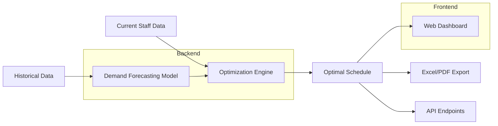
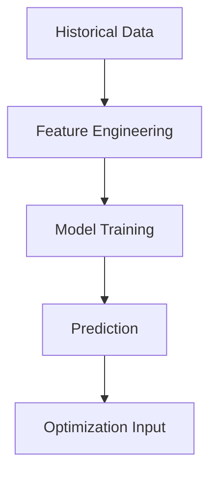

# Nurse-Scheduling

# Nurse Scheduling Optimization System


[](https://www.python.org/)
[](https://flask.palletsprojects.com/)
[](https://coin-or.github.io/pulp/)
[](LICENSE)

An intelligent decision support system that combines machine learning and mathematical optimization to create optimal nurse schedules while satisfying complex healthcare constraints.

## Table of Contents

- [Key Features](#key-features)
- [System Architecture](#system-architecture)
- [Technology Stack](#technology-stack)
- [Installation](#installation)
- [Usage](#usage)
- [Data Requirements](#data-requirements)
- [Optimization Logic](#optimization-logic)
- [Machine Learning Integration](#machine-learning-integration)
- [API Documentation](#api-documentation)
- [Deployment](#deployment)
- [Testing](#testing)
- [Contributing](#contributing)
- [License](#license)

## Key Features

### Core Capabilities
- **Demand Prediction Engine**: 
  - Time-series forecasting of patient admissions
  - Acuity-based staffing requirements
  - Holiday and seasonality adjustments

- **Optimization Engine**:
  - Generates schedules minimizing understaffing
  - Handles 50+ constraints and preferences
  - Provides optimal shift assignments

- **Visualization Dashboard**:
  - Interactive schedule visualization
  - Staffing gap analysis
  - Nurse workload metrics

### Advanced Features
- **Multi-Objective Optimization**:
  - Balances hospital needs with nurse preferences
  - Weighted scoring system for constraints

- **Scenario Analysis**:
  - "What-if" simulation for staffing changes
  - Emergency scenario planning

- **Compliance Management**:
  - Labor regulation enforcement
  - Fatigue risk monitoring
  - Skill mix validation

## System Architecture



## Technology Stack

### Backend
| Component          | Technology               |
|--------------------|--------------------------|
| Framework          | Flask                    |
| Optimization       | PuLP (CBC solver)        |
| Data Processing    | Pandas, NumPy            |
| Machine Learning   | scikit-learn, XGBoost    |
| API                | Flask-RESTful            |

### Frontend
| Component          | Technology               |
|--------------------|--------------------------|
| UI Framework       | Bootstrap 5              |
| Charts             | Chart.js                 |
| Interactive Tables | DataTables               |
| Styling            | CSS3, Sass               |

### Infrastructure
| Component          | Technology               |
|--------------------|--------------------------|
| Containerization   | Docker                   |
| Deployment         | Gunicorn, Nginx          |
| CI/CD              | GitHub Actions           |

## Installation

### Prerequisites
- Python 3.9+
- pip 20+
- Git

### Setup Instructions

1. **Clone the repository**:
   ```bash
   git clone https://github.com/yourusername/nurse-scheduling-system.git
   cd nurse-scheduling-system
   ```

2. **Set up virtual environment**:
   ```bash
   python -m venv venv
   source venv/bin/activate  # Linux/Mac
   venv\Scripts\activate     # Windows
   ```

3. **Install dependencies**:
   ```bash
   pip install -r requirements.txt
   ```

4. **Initialize directories**:
   ```bash
   mkdir -p uploads schedules static/models
   ```

5. **Set environment variables**:
   ```bash
   echo "FLASK_APP=app.py
   FLASK_ENV=development
   SECRET_KEY=your-secret-key-here" > .env
   ```

## Usage

### Running the Application
```bash
flask run --host=0.0.0.0 --port=5000
```

### Accessing the System
1. Open `http://localhost:5000` in your browser
2. Upload your input files (see [Data Requirements](#data-requirements))
3. Configure optimization parameters
4. Generate and review schedules
5. Export results as needed

### Command Line Interface
```bash
# Run optimization directly
python optimize.py --demand demand.xlsx --nurses nurses.xlsx

# Train demand prediction model
python train_model.py --data historical_data.csv
```

## Data Requirements

### Patient Demand Data (`demand.xlsx`)
| Column          | Type      | Description                          | Example        |
|-----------------|-----------|--------------------------------------|----------------|
| date            | Date      | Date of shift                        | 2025-05-01     |
| unit            | String    | Hospital unit/department             | ICU            |
| shift           | String    | Shift type (D/E/N)                   | D (Day)        |
| required_RN     | Integer   | Required RN count                    | 4              |
| acuity_low      | Integer   | Patients with low acuity             | 2              |
| acuity_medium   | Integer   | Patients with medium acuity          | 1              |
| acuity_high     | Integer   | Patients with high acuity            | 1              |

### Nurse Data (`nurses.xlsx`)
| Column               | Type      | Description                          | Example            |
|----------------------|-----------|--------------------------------------|--------------------|
| nurse_id             | String    | Unique nurse identifier              | N001               |
| unit                 | String    | Primary unit assignment              | ICU                |
| skills               | String    | Comma-separated skills               | ICU,Emergency      |
| preferred_shifts     | String    | Preferred shift types                | D,E                |
| weekend_off_pattern  | String    | Weekend availability pattern         | 2-on-1-off         |
| fte                  | Float     | Full-time equivalent (0.0-1.0)       | 0.9                |
| max_consecutive_days | Integer   | Maximum consecutive working days     | 5                  |

## Optimization Logic

### Mathematical Formulation

**Objective Function**:
```
Minimize: 
  1000 × Σ(Understaffing) 
  + 500 × Σ(Overstaffing) 
  + 100 × Σ(Preference Violations) 
  + 200 × Σ(Skill Gaps)
```

**Key Constraints**:
1. **Demand Coverage**:
   ```
   Σ(Assigned Nurses) + Understaffing ≥ Required Nurses
   ```

2. **Nurse Availability**:
   ```
   Σ(Shifts Assigned to Nurse) ≤ FTE × Max Shifts
   ```

3. **Skill Matching**:
   ```
   For each shift requiring skill S:
     Σ(Nurses with skill S) ≥ Minimum Required
   ```

4. **Workload Balance**:
   ```
   No more than 4 consecutive working days
   Minimum 12 hours between shifts
   ```

### Algorithm Flow
```python
def generate_schedule():
    # 1. Load and preprocess data
    demand = load_demand_data()
    nurses = load_nurse_data()
    
    # 2. Create optimization problem
    prob = LpProblem("Nurse_Scheduling", LpMinimize)
    
    # 3. Define decision variables
    assignments = create_decision_variables(nurses, demand)
    
    # 4. Add constraints
    add_coverage_constraints(prob, demand, nurses, assignments)
    add_fatigue_constraints(prob, nurses, assignments)
    add_skill_constraints(prob, demand, nurses, assignments)
    
    # 5. Solve and return results
    status = prob.solve()
    return extract_solution(prob, assignments)
```

## Machine Learning Integration

### Demand Prediction Pipeline



### Model Features
- **Temporal Features**:
  - Day of week
  - Month
  - Holiday flags
  - Seasonality indicators

- **Operational Features**:
  - Historical patient volumes
  - Admission trends
  - Staffing patterns

- **Environmental Features**:
  - Weather data
  - Local events
  - Epidemic status

### Example Training Code
```python
from sklearn.ensemble import RandomForestRegressor
from sklearn.pipeline import Pipeline
from sklearn.compose import ColumnTransformer
from sklearn.preprocessing import OneHotEncoder

# Feature pipeline
preprocessor = ColumnTransformer(
    transformers=[
        ('temporal', OneHotEncoder(), ['day_of_week', 'month']),
        ('numeric', 'passthrough', ['historical_avg', 'trend'])
    ])

# Model pipeline
model = Pipeline([
    ('preprocessor', preprocessor),
    ('regressor', RandomForestRegressor(n_estimators=100))
])

# Train model
model.fit(X_train, y_train)

# Save model
joblib.dump(model, 'models/demand_predictor.pkl')
```

## API Documentation

### Endpoints

| Endpoint              | Method | Description                          |
|-----------------------|--------|--------------------------------------|
| `/api/schedule`       | POST   | Generate new schedule                |
| `/api/schedule/<id>`  | GET    | Retrieve existing schedule           |
| `/api/forecast`       | POST   | Generate demand forecast             |
| `/api/nurses`         | GET    | List nurse profiles                  |

### Example Request
```bash
curl -X POST \
  http://localhost:5000/api/schedule \
  -H 'Content-Type: multipart/form-data' \
  -F demand=@demand.xlsx \
  -F nurses=@nurses.xlsx
```

### Response Format
```json
{
  "status": "success",
  "schedule_id": "sched_12345",
  "metrics": {
    "coverage_percentage": 95.2,
    "understaffed_shifts": 3,
    "preference_score": 87.5
  },
  "download_url": "/download/sched_12345.xlsx"
}
```

## Deployment

### Production Setup

1. **Using Gunicorn**:
   ```bash
   gunicorn -w 4 -b :5000 --timeout 120 app:app
   ```

2. **With Nginx**:
   ```nginx
   server {
       listen 80;
       server_name scheduler.example.com;
       
       location / {
           proxy_pass http://localhost:5000;
           proxy_set_header Host $host;
           proxy_set_header X-Real-IP $remote_addr;
       }
       
       location /static {
           alias /path/to/your/static/files;
       }
   }
   ```


### Kubernetes Setup
```yaml
apiVersion: apps/v1
kind: Deployment
metadata:
  name: nurse-scheduler
spec:
  replicas: 3
  template:
    spec:
      containers:
      - name: scheduler
        image: nurse-scheduler:latest
        ports:
        - containerPort: 5000
        volumeMounts:
        - mountPath: /app/uploads
          name: uploads
      volumes:
      - name: uploads
        persistentVolumeClaim:
          claimName: uploads-pvc
```

## Testing

### Running Tests
```bash
python -m pytest tests/
```

### Test Coverage
```bash
pytest --cov=app --cov=models tests/
```

### Test Types
1. **Unit Tests**:
   - Model validation
   - Constraint checking
   - Data parsing

2. **Integration Tests**:
   - Full optimization pipeline
   - API endpoints
   - Data flow

3. **Performance Tests**:
   - Scaling benchmarks
   - Large dataset handling
   - Stress testing

## Contributing

### Development Workflow

1. **Set up development environment**:
   ```bash
   git clone https://github.com/yourusername/nurse-scheduling-system.git
   cd nurse-scheduling-system
   python -m venv venv
   source venv/bin/activate
   pip install -r requirements-dev.txt
   ```

2. **Create a feature branch**:
   ```bash
   git checkout -b feature/your-feature
   ```

3. **Implement your changes**:
   - Follow PEP 8 style guide
   - Add appropriate tests
   - Update documentation

4. **Submit a pull request**:
   - Describe changes clearly
   - Reference related issues
   - Include test results

### Code Standards
- PEP 8 compliance
- Type hints for all functions
- Docstrings for all modules
- 80%+ test coverage


### Thank You
